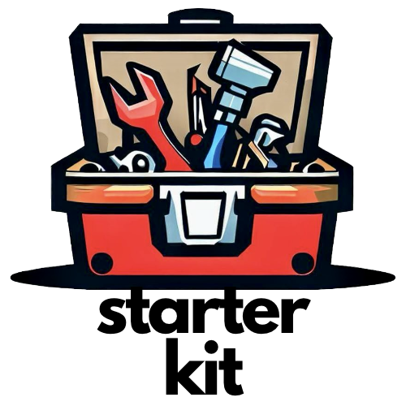

# Starter Kit for Laravel 8|9|10

[![Latest Version on Packagist][ico-version]][link-packagist]
[![Total Downloads][ico-downloads]][link-downloads]
[![GitHub Repo stars][ico-stars]][link-stars]
[](https://discord.gg/MBxxAkQAxx)
[![Twitter Follow][ico-twitter]][link-twitter]

<p align="center"></p>

The Starter Kit package is the counterpart of [Boilerplate Generator package](https://packagist.org/packages/luchavez/boilerplate-generator). This package is a required dependency since it will be used by the domains (DDD) and packages generated through "Boilerplate Generator".

## Installation

The straightforward way to install this package goes like this:
``` bash
composer require luchavez/starter-kit --with-all-dependencies
```

The preferred way is to install it is via another package called [luchavez/boilerplate-generator](https://packagist.org/packages/luchavez/boilerplate-generator).
```bash
composer require luchavez/boilerplate-generator --dev --with-all-dependencies
php artisan bg:install
php artisan bg:env:publish --all
```

## Dependencies

| Package                        | Packagist                                                                   |
|--------------------------------|-----------------------------------------------------------------------------|
| `illuminate/support`           | [~8 or ~9 or ~10](https://packagist.org/packages/illuminate/support)        |
| `composer/composer`            | [^2.5](https://packagist.org/packages/composer/composer)                    |
| `hammerstone/fast-paginate`    | [^1.0](https://packagist.org/packages/hammerstone/fast-paginate)            |
| `spatie/laravel-query-builder` | [^5.2 or ^4.0](https://packagist.org/packages/spatie/laravel-query-builder) |

## Change log

Please see the [changelog](changelog.md) for more information on what has changed recently.

## Testing

``` bash
$ composer test
```

## Contributing

Please see [contributing.md](contributing.md) for details and a todolist.

## Security

If you discover any security related issues, please email jamescarloluchavez@gmail.com instead of using the issue tracker.

## Credits

- [James Carlo Luchavez][link-author]
- [All Contributors][link-contributors]

## License

MIT. Please see the [license file](license.md) for more information.

[ico-version]: https://img.shields.io/packagist/v/luchavez/starter-kit.svg
[ico-downloads]: https://img.shields.io/packagist/dt/luchavez/starter-kit.svg
[ico-stars]: https://img.shields.io/github/stars/luchavez-technologies/starter-kit
[ico-discord]: https://img.shields.io/discord/1143744619956404295?color=8c9eff&label=Discord&logo=discord
[ico-twitter]: https://img.shields.io/twitter/follow/luchaveztech

[link-packagist]: https://packagist.org/packages/luchavez/starter-kit
[link-downloads]: https://packagist.org/packages/luchavez/starter-kit
[link-stars]: https://github.com/luchavez-technologies/starter-kit
[link-discord]: https://discord.gg/MBxxAkQAxx
[link-twitter]: https://twitter.com/luchaveztech

[link-author]: https://github.com/luchavez-technologies
[link-contributors]: ../../contributors
